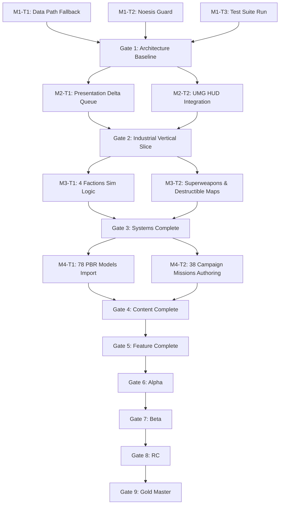

# Task & Milestone Dependency Graph (`DEPENDENCY_GRAPH.md`)

**Document Version**: 4.0  
**Project Title**: *Iron Resonance: Command of Tomorrow*  

---

## 1. Visual Dependency Graph (Mermaid)

---

## 2. Execution Dependency Rules

- **Rule 1**: Sub-agents MUST NOT claim or execute a task whose parent prerequisites in `DEPENDENCY_GRAPH.md` are not marked as `PASSED`.
- **Rule 2**: Tasks within the same milestone gate that touch different file paths MAY be executed in parallel by concurrent sub-agents.
