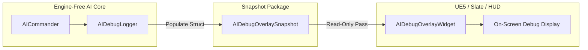

# Red Alert 4 — AI Debugging & Diagnostics Architecture

## Overview

The AI Commander in Red Alert 4 features built-in **Explainable AI (XAI)** diagnostics, zero-overhead debug snapshotting, and determinism desync detection tools. Because the simulation and AI modules are engine-free, all diagnostics compile cleanly into headless C++ test runners and can be rendered visually by UE5 HUD overlays via snapshot data structures without introducing runtime engine dependencies.

---

## 1. AIDebugOverlaySnapshot & Visual Debug Overlay

### 1.1 Snapshot Data Structure (`RA4AI/Public/RA4AI/AIDebugOverlay.h`)
`AIDebugOverlaySnapshot` provides a lightweight, thread-safe data package containing the complete internal state of an AI Commander instance at any given simulation tick:

```cpp
struct ArmyGroupSnapshot
{
    uint32_t GroupId = 0;
    std::string Name;
    GroupRole Role = GroupRole::MainAssault;
    GroupStance Stance = GroupStance::Balanced;
    GroupTaskType Task = GroupTaskType::Idle;
    int32_t MemberCount = 0;
    int32_t MoralePercent = 100;
    Vec2 TargetLocation = Vec2::Zero();
};

struct AIDebugOverlaySnapshot
{
    PlayerId Player = 0;
    std::string CommanderName;
    std::string DoctrineName;
    AIStrategy ActiveStrategy = AIStrategy::ExpandEconomy;
    int32_t StrategyScore = 0;
    std::string CurrentGoal;

    int32_t Credits = 0;
    int32_t PowerProduced = 0;
    int32_t PowerConsumed = 0;

    int32_t KnownEnemiesCount = 0;
    int32_t AverageConfidencePercent = 100;

    std::vector<ArmyGroupSnapshot> ActiveGroups;
    std::vector<std::string> RecentDecisions;
};
```

### 1.2 Presentation Decoupling Architecture
To decouple simulation diagnostics from Unreal Engine presentation rendering:
1. The C++ `AICommander` generates an `AIDebugOverlaySnapshot` on demand or during diagnostic passes using `AIDebugLogger::CreateSnapshot()`.
2. The snapshot is exposed to the UI/HUD presentation layer (e.g. `RA4Presentation` module or Slate debug widgets) via read-only const references.
3. The HUD widget formats the snapshot into visual debug panels (strategy badges, army group list, decision logs, FOW memory metrics) without accessing private simulation pointers.



---

## 2. AIDebugLogger & Explainable AI (XAI) Logging

### 2.1 AIDecision Diagnostic Struct
Every decision executed by `AICommander` generates an `AIDecision` log record (`RA4AI/Public/RA4AI/AICommander.h`), storing explicit reasoning behind every macro choice:

```cpp
struct AIDecision
{
    TickIndex Tick = 0;
    CommandType Command = CommandType::None;
    ContentId Content;
    AIStrategy Strategy = AIStrategy::ExpandEconomy;
    int32_t StrategyScore = 0;
    AIStrategy PreviousStrategy = AIStrategy::ExpandEconomy;
    std::string Reason;
};
```

### 2.2 Explainable Log Traces
When an AI Commander executes an action, it logs a formatted trace explaining *what* was chosen, *why* it was selected, and *what alternative score* triggered the shift.

#### Sample XAI Execution Trace Output
```text
[Tick 00120] AI Commander P1 (General Sokolov | SovietArmoredPush):
  Selected Strategy: ExpandEconomy (Score: 450, Prev: ExpandEconomy)
  Reason: Target harvesters (1/3) below quota. Building Refinery at tile (42, 18).

[Tick 00480] AI Commander P1 (General Sokolov | SovietArmoredPush):
  Selected Strategy: AssembleArmy (Score: 320, Prev: ExpandEconomy)
  Reason: Economy stable (Refineries: 2, Harvesters: 3). Production idle. Training Conscript.

[Tick 01250] AI Commander P1 (General Sokolov | SovietArmoredPush):
  Selected Strategy: Assault (Score: 680, Prev: AssembleArmy)
  Reason: Combat unit count (8) >= AttackArmySize (6). Target acquired from FOW memory: Known enemy Barracks at tile (112, 84) [Confidence: 0.92]. Dispatching Squad 1 (MainAssault).

[Tick 01820] AI Commander P1 (General Sokolov | SovietArmoredPush):
  Selected Strategy: Fortify (EMERGENCY Score: 900, Prev: Assault)
  Reason: EMERGENCY OVERRIDE! Base under attack at tile (40, 20). Recalling Squad 1 to defend Construction Yard.
```

### 2.3 Diagnostic Log Buffer Management
* `SetDecisionLogLimit(size_t Limit)` configures the ring buffer size (default: 64 entries) to avoid unbounded heap growth during long skirmish matches.
* Log entries are accessible via `GetDecisionLog()` for headless test assertions and match report exports.

---

## 3. Replay Desync Diagnosis & Determinism Safeguards

Multiplayer lockstep integrity and replay reproducibility require that identical initial seeds produce 100% byte-for-byte identical match states across execution runs.

### 3.1 State Checksum Computation
After every tick, `SimWorld` calculates a 64-bit deterministic hash `ComputeStateChecksum()` (`RA4Simulation/SimWorld.h:128`):

$$\text{Checksum} = \text{Hash}\Big( \text{Tick}, \{\text{EntityState}_i\}, \{\text{PlayerCredits}_p\}, \{\text{FogGrids}_p\} \Big)$$

```cpp
// Checksum assertion during deterministic verification test
uint64_t HashRun1 = RunMatchHeadless(Seed = 1337, MaxTicks = 3500);
uint64_t HashRun2 = RunMatchHeadless(Seed = 1337, MaxTicks = 3500);

RA4_EXPECT(HashRun1 == HashRun2); // Must match exactly!
```

### 3.2 Desync Detection Methodology (`ProvingGround.ForcedDesyncDetection`)
To detect out-of-sync bugs during development:
1. **Parallel Shadow Runs:** Two identical `SimWorld` instances run in parallel, fed the same initial `Seed` and input `CommandFrame` stream.
2. **Forced Desync Test:** `TestProvingGround.cpp` injects a single un-seeded random variation or unauthorized state mutation into World 2.
3. **Instant Detection:** The checksum mismatch is flagged immediately on the exact tick of divergence:

```text
[DESYNC DETECTED] Match Tick: 412
  World 1 Checksum: 0x9F4A8B12C3D041E5
  World 2 Checksum: 0x9F4A8B12C3D099FF
  Diverging Subsystem: AICommander P2 Target Assignment
  Root Cause: Unseeded rand() call in tactical target selection!
```

### 3.3 Anti-Desync Rules for AI Developers
To ensure 100% deterministic AI execution:
- **Rule 1:** Never use standard C `rand()` or C++ `<random>` `std::mt19937`. Always use the instance-bound `Random` generator (`AICommander::Rng`) seeded with `Seed`.
- **Rule 2:** Never iterate over unordered containers (`std::unordered_map`, `std::unordered_set`) when issuing commands or selecting targets. Always iterate over deterministic ordered vectors or maps keyed by `EntityId`.
- **Rule 3:** Never read system clock time (`std::chrono`) inside AI decision logic. Use `World.GetTick()` for all temporal evaluation.
