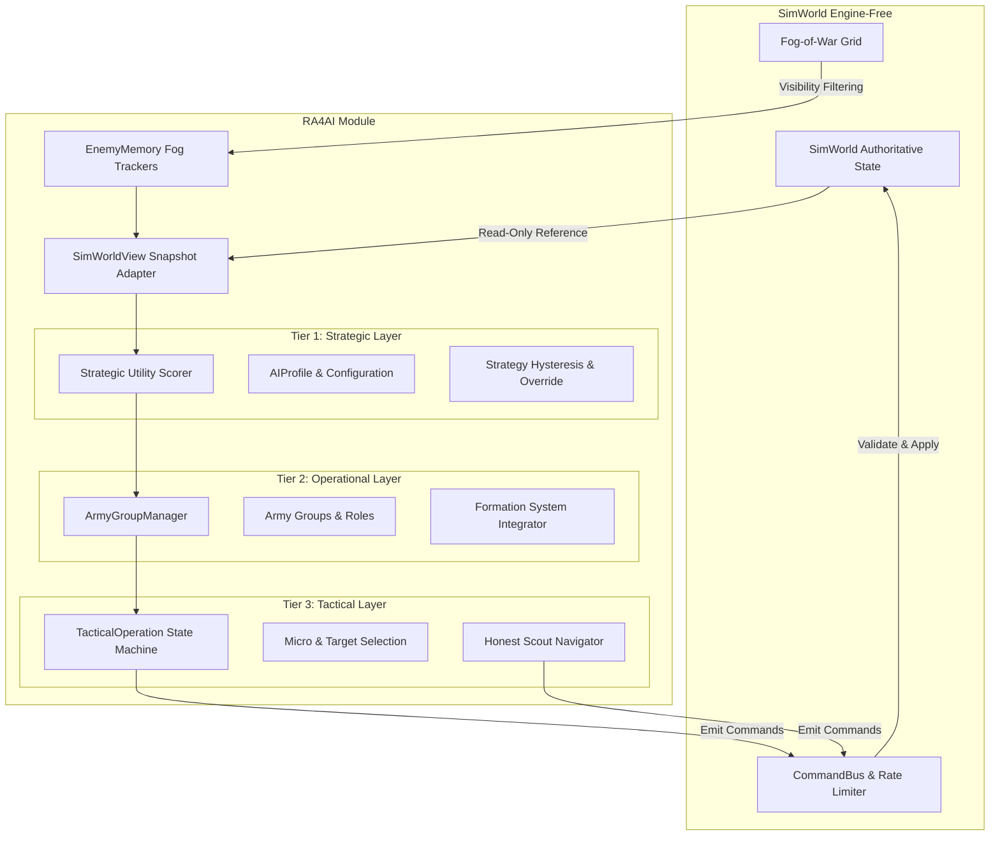

# Red Alert 4 — AI Commander Architecture

## Overview & Core Principles

The Red Alert 4 AI Commander system is a **3-tier hierarchical engine-free decision architecture** designed for high-performance RTS gameplay, absolute multiplayer determinism, and strict anti-cheat compliance. It operates strictly outside the Unreal Engine runtime framework (`Engine`, `CoreUObject`, `Slate`), communicating with the simulation using read-only interface snapshots (`IAIWorldView`) and dispatching actions exclusively through standard client commands (`Command` objects) sent via the `CommandBus`.



---

## 1. Three-Tier Decision Hierarchy

The AI Commander architecture decouples long-term strategic macro decisions from operational force grouping and tactical unit micro execution.

```
+-----------------------------------------------------------------------+
|                       TIER 1: STRATEGIC LAYER                         |
| Evaluates game state every N ticks (default: 10 ticks / 0.5s @ 20Hz)   |
| Computes utility scores for 6 core strategies:                        |
|   ExpandEconomy, TechUp, Fortify, AssembleArmy, Assault, Recover       |
+-----------------------------------------------------------------------+
                                   |
                                   v
+-----------------------------------------------------------------------+
|                      TIER 2: OPERATIONAL LAYER                        |
| Manages persistent force structures via ArmyGroup & ArmyGroupManager  |
| Assigns unit composition, group roles, rally points, & stances        |
| Role types: Reserve, Scout, QuickResponse, MainAssault, BaseGuard     |
+-----------------------------------------------------------------------+
                                   |
                                   v
+-----------------------------------------------------------------------+
|                       TIER 3: TACTICAL LAYER                          |
| Manages active squad operations via TacticalOperation state machine   |
| States: Proposed -> Gathering -> Staging -> Advancing -> Engaging      |
| Handles target selection, squad staging, retreat thresholds & micro    |
+-----------------------------------------------------------------------+
```

### 1.1 Tier 1: Strategic Utility Layer
* **Files:** `RA4AI/Public/RA4AI/AIStrategy.h`, `RA4AI/Private/AIStrategy.cpp`, `RA4AI/Private/AICommander.cpp`
* **Execution Interval:** `Config.DecisionIntervalTicks` (default: 10 ticks / 500 ms at 20 Hz).
* **Core Functionality:**
  - `BuildAssessment(const SimWorld& World)` builds an `AIWorldAssessment` snapshot containing current credits, power surplus/deficit, harvester counts, building assets, armed unit strength, and fog-filtered enemy target awareness.
  - `ScoreStrategies(Assessment, Config)` evaluates 6 fundamental strategy options using utility scoring equations:
    1. **`ExpandEconomy`**: High weight when refineries/harvesters are below `TargetHarvesters` (default 3) or credit flow is stalled.
    2. **`TechUp`**: Prioritizes tier-up structures when economy is stable and `Credits >= CreditReserve`.
    3. **`Fortify`**: Triggered when base is under attack (`bUnderAttack`) or defensive building count is below target.
    4. **`AssembleArmy`**: Prioritized when army unit count is below operational thresholds (`AttackArmySize`).
    5. **`Assault`**: Scores highest when armed unit strength exceeds `AttackArmySize` (default 6) and known enemy targets exist.
    6. **`Recover`**: Emergency strategy when construction yards or key refineries are lost; allows spending below standard credit reserves.
  - **Hysteresis & Override:** `SelectStrategy()` applies `StrategySwitchMargin` (default 100 points) to prevent rapid strategy oscillation ("flapping"). If an emergency condition occurs (e.g., base under active attack), `EmergencyStrategyScore` (900 points) overrides hysteresis immediately.

```cpp
// Strategic Utility Scoring Function Signature
RA4AI_API std::vector<AIStrategyScore> ScoreStrategies(
    const AIWorldAssessment& Assessment, 
    const AIConfig& Config
);

RA4AI_API AIStrategy SelectStrategy(
    const std::vector<AIStrategyScore>& Scores,
    AIStrategy CurrentStrategy,
    bool bHasCurrentStrategy,
    const AIConfig& Config
);
```

### 1.2 Tier 2: Operational Layer (Army Groups)
* **Files:** `RA4AI/Public/RA4AI/ArmyGroup.h`, `RA4AI/Private/ArmyGroup.cpp`
* **Core Functionality:**
  - Manages persistent operational army units using `ArmyGroupManager` and `ArmyGroup` structures.
  - Groups are assigned stable 32-bit `GroupId` values for replay stability and UI overlay rendering.
  - Defines force roles via `GroupRole`: `Reserve`, `Scout`, `QuickResponse`, `MainAssault`, `ArtillerySupport`, `AntiAir`, `BaseGuard`, `EconRaid`, `Naval`.
  - Maintains group stances via `GroupStance`: `Balanced`, `Aggressive`, `Defensive`, `HoldFire`, `HoldPosition`, `ReturnFire`.
  - Integrates formation movement shapes (`GroupFormationShape`: `Line`, `Column`, `Wedge`, `Spread`, `Screen`, `Circular`, `Transport`) leveraging `RA4Navigation/Formation.h`.

```cpp
struct ArmyGroup
{
    uint32_t GroupId = 0;
    std::string Name;
    GroupRole Role = GroupRole::MainAssault;
    GroupStance Stance = GroupStance::Balanced;
    GroupTaskType Task = GroupTaskType::Idle;

    EntityId Leader;
    std::vector<EntityId> Members;
    std::map<ContentId, int32_t> TargetComposition;

    Vec2 RallyPoint = Vec2::Zero();
    Vec2 TargetLocation = Vec2::Zero();
    EntityId TargetEntity;

    GroupFormationShape FormationShape = GroupFormationShape::Line;
    int32_t FormationSpacing = 80; // World units

    int32_t CombatReadiness = 100;
    int32_t MoralePercent = 100;
    int32_t RetreatThresholdPercent = 30;

    TickIndex AssignedTick = 0;
    TickIndex LastOrderTick = 0;
    bool bAwaitingReinforcements = false;
};
```

### 1.3 Tier 3: Tactical Layer (Squad Operations & Micro)
* **Files:** `RA4AI/Public/RA4AI/TacticalOperation.h`, `RA4AI/Private/TacticalOperation.cpp`, `RA4AI/Private/AICommander.cpp`
* **Core Functionality:**
  - Implements the `TacticalOperation` state machine for execution of combat operations:
    ```
    Proposed -> Gathering -> Staging -> Advancing -> Engaging -> [Completed / Retreating / Aborted]
    ```
  - **ReconcileSquad:** Periodically prunes dead entities and assigns idle combat units to active operations.
  - **Staging & Assembly:** Squads gather at a calculated base staging point (`StagingPoint`) before advancing. Once all units reach staging proximity (`AllSquadAtStaging()`), the state transitions to `Advancing`.
  - **Retreat Micro:** Wounded units (HP below threshold or overall force strength below `MinRetreatUnits`) break off and issue retreat move commands back to base (`IssueSquadRetreat`).

```cpp
enum class OperationState : uint8_t
{
    Proposed = 0,
    Gathering,
    Staging,
    Advancing,
    Engaging,
    Retreating,
    Completed,
    Aborted
};
```

---

## 2. SimWorldView & Fog-of-War Knowledge Model

### 2.1 Clean-Room Anti-Cheat Guarantee
A fundamental rule of the Red Alert 4 AI architecture is that **the AI cannot cheat by reading hidden world state**. Direct iteration over enemy entities in `SimWorld` is prohibited. The commander accesses world state exclusively through the `IAIWorldView` interface implemented by `SimWorldView`.

```cpp
class RA4AI_API IAIWorldView
{
public:
    virtual ~IAIWorldView() = default;

    virtual TickIndex GetCurrentTick() const = 0;
    virtual PlayerId GetPlayerId() const = 0;
    virtual FactionId GetFactionId() const = 0;
    virtual int32_t GetCredits() const = 0;
    virtual int32_t GetPowerProduced() const = 0;
    virtual int32_t GetPowerConsumed() const = 0;
    virtual int32_t GetTotalHarvested() const = 0;

    virtual const std::vector<EnemyMemory>& GetKnownEnemies() const = 0;
    virtual const ContentDatabase* GetContent() const = 0;
    virtual bool HasPrerequisites(ContentId Content) const = 0;
    virtual bool IsPlacementValid(ContentId Structure, TileCoord Tile) const = 0;
    virtual const SimWorld& GetSimWorldUnsafe() const = 0;
};
```

### 2.2 Memory Tracking & Confidence Decay
`SimWorldView` tracks spotted enemy units and structures using `EnemyMemory` objects.
* **Update Observation:** Every `MemoryUpdateIntervalTicks` (default: 5 ticks / 250 ms), `UpdateMemory()` checks the AI player's fog grid (`World.GetFogGrid()`). Only tiles flagged as `CurrentlyVisible` or `RadarDetected` populate or refresh `KnownEnemies`.
* **Confidence Decay:** When an enemy entity moves into fog of war, its `Confidence` decays linearly over time:
  $$\text{Confidence}(t) = \max\left(0.1, 1.0 - \frac{t - t_{\text{last\_seen}}}{T_{\text{retention}}}\right)$$
  where $T_{\text{retention}} = \text{MemoryRetentionTicks}$ (default: 600 ticks = 30 seconds at 20 Hz).
* **Purging:** If an entity remains unobserved longer than `MemoryRetentionTicks`, its memory record is dropped entirely from `KnownEnemies`.

```cpp
struct EnemyMemory
{
    EntityId Entity;
    TileCoord Position{0, 0};
    TickIndex LastSeenTick = 0;
    ContentId DefId;
    EntityKind Kind = EntityKind::Unit;
    Fixed Confidence = Fixed::FromInt(1); // 1.0 = fresh, decays over time in fog
};
```

### 2.3 Honest Scouting Mechanism
Because the AI cannot see through fog of war, it relies on scouting to discover enemy base locations and unit movements.
* `TryScout()` selects an idle unit assigned to `EntityRole::Scout` (or a basic combat unit).
* The commander iterates through map quadrant waypoints (`NextScoutWaypoint`).
* Scout orders emit standard `AttackMove` or `Move` commands, revealing fog tiles naturally through the simulation's fog vision pipeline.

---

## 3. EntityRole Bitmask Taxonomy

To prevent hardcoding unit definitions or branching on raw unit class strings, Red Alert 4 uses an engine-free 32-bit bitmask enum `EntityRole`.

### 3.1 Role Definition (`RA4Content/Public/RA4Content/ContentTypes.h`)

```cpp
enum class EntityRole : uint32_t
{
    None         = 0,
    Harvester    = 1u << 0,  // Economic resource gatherers
    Builder      = 1u << 1,  // Mobile construction vehicles / builders
    Scout        = 1u << 2,  // Fast recon units
    Combat       = 1u << 3,  // Standard armed combatants
    AntiAir      = 1u << 4,  // Anti-aircraft capability
    AntiArmor    = 1u << 5,  // Heavy anti-tank / anti-armor weapons
    Artillery    = 1u << 6,  // Long-range siege weapons
    Engineer     = 1u << 7,  // Structure capturing & repair units
    BaseBuilding = 1u << 8,  // Core base structures (HQ, CY)
    Power        = 1u << 9,  // Power generation structures
    Refinery     = 1u << 10, // Ore processing facilities
    Defense      = 1u << 11, // Defensive turrets and walls
    Production   = 1u << 12, // Factories, barracks, airfields, shipyards
};
```

### 3.2 Automated Role Derivation
`ContentDatabase::DeriveEntityRoles(const EntityDef& Def)` automatically inspects entity parameters upon content loading and assigns roles dynamically:

```cpp
EntityRole ContentDatabase::DeriveEntityRoles(const EntityDef& Def) const
{
    EntityRole Roles = EntityRole::None;

    if (Def.Kind == EntityKind::Building)
    {
        Roles |= EntityRole::BaseBuilding;
        if (Def.Building.bIsPowerPlant) Roles |= EntityRole::Power;
        if (Def.Building.bIsRefinery)   Roles |= EntityRole::Refinery;
        if (Def.Building.bIsFactory)    Roles |= EntityRole::Production;
        if (Def.Building.bIsTurret)     Roles |= EntityRole::Defense;
    }
    else if (Def.Kind == EntityKind::Unit)
    {
        if (Def.Unit.bIsHarvester) Roles |= EntityRole::Harvester;
        if (Def.Unit.bIsBuilder)   Roles |= EntityRole::Builder;
        if (Def.Unit.bIsEngineer)  Roles |= EntityRole::Engineer;

        if (Def.Weapon.IsValid())
        {
            Roles |= EntityRole::Combat;
            if (Def.Unit.MoveSpeed > Fixed::FromInt(120)) Roles |= EntityRole::Scout;
            if (Def.Weapon.bTargetAir)                   Roles |= EntityRole::AntiAir;
            if (Def.Weapon.PrimaryWarhead == WarheadType::AP) Roles |= EntityRole::AntiArmor;
            if (Def.Weapon.Range > Fixed::FromInt(500))  Roles |= EntityRole::Artillery;
        }
    }
    return Roles;
}
```

Bitwise operators (`|`, `&`, `~`, `|=`, `&=`) and the `HasRole(Roles, Target)` helper allow zero-overhead bitmask filtering during AI target selection and army group composition.

---

## 4. CommandBus Integration & Anti-Spam Budgeting

### 4.1 Client Command Parity
The AI Commander does not mutate `SimWorld` state directly. During `AICommander::Tick(World, OutCommands)`, it generates standard client commands:
- `CommandType::PlaceBuilding`
- `CommandType::QueueProduction`
- `CommandType::Move`
- `CommandType::AttackMove`
- `CommandType::Attack`
- `CommandType::Retreat`
- `CommandType::SetRallyPoint`

```cpp
void AICommander::Tick(const SimWorld& World, std::vector<Command>& OutCommands)
{
    UpdateKnowledge(World);
    
    // Process strategic scoring every DecisionIntervalTicks
    if (TicksSinceDecision >= Config.DecisionIntervalTicks)
    {
        AIWorldAssessment Assessment = BuildAssessment(World);
        std::vector<AIStrategyScore> Scores = ScoreStrategies(Assessment, Config);
        ActiveStrategy = SelectStrategy(Scores, ActiveStrategy, bHasActiveStrategy, Config);
        ExecuteStrategy(ActiveStrategy, World, OutCommands);
        TicksSinceDecision = 0;
    }
    
    // Execute squad tactical operations & army micro
    ReconcileSquad(World);
    CommandArmy(World, OutCommands);
}
```

### 4.2 Rate Limiting & Determinism Safeguards
* **Server Command Budget:** The AI operates under the exact same rate limit as human players (`kMaxCommandsPerPlayerPerTick = 64` defined in `SimWorld.h`). Orders exceeding this cap are rejected with `CommandReject::RateLimited`.
* **Idle-Only Ordering:** To guarantee compliance with the command budget, `CommandArmy()` only issues new orders to units whose `OrderQueue` is currently empty.
* **Deterministic Pseudo-Random Numbers:** Each `AICommander` instance owns a dedicated `Random` generator initialized with a deterministic seed (`uint64_t Seed`) passed to `Initialize()`. AI decisions generate zero side-effects on global state, ensuring 100% lockstep multiplayer synchronization and exact replay fidelity.
