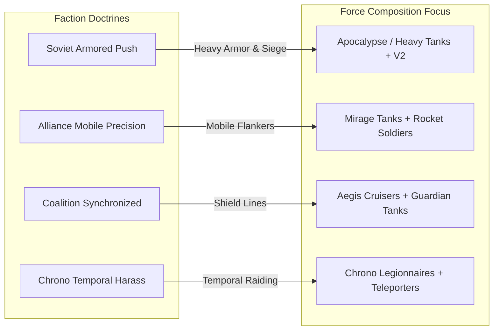

# Red Alert 4 — AI Faction Doctrines & Commander Personalities

## Overview

In Red Alert 4, the computer opponent does not use a single monolithic decision algorithm. Instead, high-level strategic preferences and tactical behaviors are governed by **Faction Doctrines** and **Commander Personalities**. This system translates faction-specific lore and unit rosters—Soviet armored columns, Alliance precision strike craft, Coalition synchronized battle lines, and Chrono temporal raiders—into distinct, reproducible AI behaviors.

---

## 1. Faction Doctrine Definitions

The enum `AIDoctrineType` (`RA4AI/Public/RA4AI/AIDoctrine.h`) defines four primary operational paradigms corresponding to the game's core factions:

```cpp
enum class AIDoctrineType : uint8_t
{
    SovietArmoredPush = 0,    // Heavy front, armored push, V2 artillery prep
    AllianceMobilePrecision,  // High mobility, recon, flanking, high-value unit preservation
    CoalitionSynchronized,   // Formation shields, area denial, synchronized strikes
    ChronoTemporalHarass     // Hit-and-run, temporal abilities, mobile reserves
};
```



---

## 2. Comprehensive Doctrine Specifications

### 2.1 Soviet Armored Push (`SovietArmoredPush`)
* **Faction Alignment:** Soviet Union (`FactionId::Soviet`)
* **Strategic Philosophy:** Direct, overwhelming frontline force. Focuses on heavy armored breakthroughs supported by long-range V2 rocket artillery. Accepts high casualties if structural objectives (enemy HQ, Superweapons) are eliminated.
* **Operational Characteristics:**
  - **Minimum Assault Force Size:** 10 units
  - **Preferred Formations:** Line / Column heavy armored spearhead
  - **Scout Priority:** Moderate (70)
  - **Acceptable Casualties:** High (40%)
  - **Flanking Tendency:** Low (30%)
* **Army Role Ratios:**
  - Infantry: 30%
  - Anti-Armor (Heavy Tank/Apocalypse): 30%
  - Anti-Air (Flak Track): 20%
  - Artillery (V2 Rocket Launcher): 10%
  - Support: 10%

### 2.2 Alliance Mobile Precision (`AllianceMobilePrecision`)
* **Faction Alignment:** Allied Factions (`FactionId::Alliance`)
* **Strategic Philosophy:** High mobility, stealth, and precision strikes. Prioritizes continuous map scouting, economic raiding, and preserve-at-all-cost management of high-value tech units.
* **Operational Characteristics:**
  - **Minimum Assault Force Size:** 6 units
  - **Preferred Formations:** Spread / Wedge flanking formations
  - **Scout Priority:** Very High (90)
  - **Acceptable Casualties:** Very Low (15%)
  - **Flanking Tendency:** Very High (80%)
* **Army Role Ratios:**
  - Infantry (Riflemen/Javelin): 20%
  - Anti-Armor (Guardian/Mirage Tank): 25%
  - Anti-Air (IFV/Multigunner): 20%
  - Artillery (Athena Cannon): 15%
  - Support/Recon: 20%

### 2.3 Coalition Synchronized (`CoalitionSynchronized`)
* **Faction Alignment:** Eastern Coalition (`FactionId::Coalition`)
* **Strategic Philosophy:** Area denial, synchronized multi-squad battle lines, and heavy defensive shielding. Forces advance strictly within mutual coverage distance of mobile force fields and repair hubs.
* **Operational Characteristics:**
  - **Minimum Assault Force Size:** 12 units
  - **Preferred Formations:** Screen / Circular overlapping defense
  - **Scout Priority:** High (75)
  - **Acceptable Casualties:** Moderate (25%)
  - **Flanking Tendency:** Low (20%)
* **Army Role Ratios:**
  - Infantry: 25%
  - Anti-Armor: 25%
  - Anti-Air: 20%
  - Artillery: 15%
  - Support (Shield Generators/Repairs): 15%

### 2.4 Chrono Temporal Harass (`ChronoTemporalHarass`)
* **Faction Alignment:** Chrono Vanguard (`FactionId::Chrono`)
* **Strategic Philosophy:** Constant multi-vector hit-and-run harassment using temporal teleportation and phase shifts. Avoids sustained head-on engagements, concentrating instead on enemy harvesters and isolated power grids.
* **Operational Characteristics:**
  - **Minimum Assault Force Size:** 4 units (multi-vector raiding squads)
  - **Preferred Formations:** Spread / Transport rapid phase shifts
  - **Scout Priority:** Maximum (95)
  - **Acceptable Casualties:** Low (20%)
  - **Flanking Tendency:** Maximum (90%)
* **Army Role Ratios:**
  - Infantry (Chrono Legionnaires): 30%
  - Anti-Armor (Chrono Tanks): 30%
  - Anti-Air: 15%
  - Artillery/Harassers: 15%
  - Support: 10%

---

## 3. AIPersonality Parameters & Data Structure

Personality profiles fine-tune how a commander executes its faction doctrine. The `AIPersonality` structure (`RA4AI/Public/RA4AI/AIDoctrine.h`) controls tactical thresholds:

```cpp
struct AIPersonality
{
    std::string Name = "General";
    AIDoctrineType Doctrine = AIDoctrineType::SovietArmoredPush;

    int32_t Aggressiveness = 50;           // 0..100: Willingness to attack with smaller armies
    int32_t Cautiousness = 50;             // 0..100: Distance kept from enemy defenses
    int32_t EconomicRisk = 50;             // 0..100: Propensity to expand before army is ready
    int32_t ScoutPriority = 70;            // 0..100: Frequency of scouting dispatch
    int32_t AcceptableLossesPercent = 40;  // 0..100: Squad HP threshold before calling retreat
    int32_t ReserveDepthPercent = 20;     // 0..100: Percentage of army kept at base for defense
    int32_t FlankingTendency = 30;         // 0..100: Weight given to indirect attack paths
    int32_t RegroupFrequencyTicks = 40;    // Ticks between squad regrouping passes
    int32_t ThreatSensitivity = 60;        // 0..100: Reaction speed to spotted enemy forces

    // Preferred army composition ratios by role
    int32_t RatioInfantry = 30;
    int32_t RatioAntiArmor = 30;
    int32_t RatioAntiAir = 20;
    int32_t RatioArtillery = 10;
    int32_t RatioSupport = 10;
};
```

---

## 4. AI Profiles & Build Order Scoring

The high-level profile (`AIProfile`) dictates economic and military weighting multipliers passed to the utility scorer via `MakeProfileConfig()` (`RA4AI/Public/RA4AI/AIStrategy.h`).

### 4.1 AI Profiles

| Profile | Focus Area | Economic Weight | Army Weight | Assault Weight | Defence Weight | Target Harvesters | Attack Army Size |
| :--- | :--- | :---: | :---: | :---: | :---: | :---: | :---: |
| **`Adaptive` / `Balanced`** | Balanced macro & micro | 100 | 100 | 100 | 100 | 3 | 6 |
| **`Aggressive`** | Fast rushes & harassment | 70 | 140 | 160 | 60 | 2 | 4 |
| **`Defensive`** | Base fortresses & turtle | 90 | 100 | 70 | 160 | 3 | 10 |
| **`Economic`** | High greed & fast boom | 160 | 70 | 60 | 80 | 5 | 8 |

### 4.2 Utility Scoring Equations

During every decision pass (`DecisionIntervalTicks`), `ScoreStrategies()` computes integer utility scores $S(\text{Strategy})$ for each strategy:

#### Expand Economy Score
$$S(\text{Economy}) = W_{\text{econ}} \times \left( (N_{\text{target\_harv}} - N_{\text{harv}}) \times 150 + \max(0, 2 - N_{\text{refinery}}) \times 200 \right)$$
*If $N_{\text{harv}} \ge N_{\text{target\_harv}}$ and $N_{\text{refinery}} \ge 2$, $S(\text{Economy})$ decays to 0.*

#### Tech Up Score
$$S(\text{Tech}) = W_{\text{tech}} \times \left( \mathbb{I}(\text{Credits} \ge C_{\text{reserve}}) \times 120 + N_{\text{refinery}} \times 40 \right)$$

#### Fortify Score
$$S(\text{Fortify}) = W_{\text{defence}} \times \left( \mathbb{I}(\text{bUnderAttack}) \times 800 + \max(0, N_{\text{target\_def}} - N_{\text{def}}) \times 150 \right)$$

#### Assemble Army Score
$$S(\text{Army}) = W_{\text{army}} \times \left( \max(0, N_{\text{target\_army}} - N_{\text{armed}}) \times 80 \right)$$

#### Assault Score
$$S(\text{Assault}) = W_{\text{assault}} \times \left( \mathbb{I}(N_{\text{armed}} \ge N_{\text{min\_assault}}) \times (N_{\text{armed}} \times 50) + \mathbb{I}(\text{bHasEnemyTarget}) \times 200 \right)$$

#### Recover Score
$$S(\text{Recover}) = W_{\text{recover}} \times \left( \mathbb{I}(\text{No Refineries}) \times 1000 + \mathbb{I}(\text{No CY}) \times 800 \right)$$

---

## 5. Doctrine Registry Interface

`AIDoctrineRegistry` provides static creation and factory methods to retrieve configured doctrine parameters per faction and profile:

```cpp
class RA4AI_API AIDoctrineRegistry
{
public:
    static FactionDoctrineDef GetDoctrineForFaction(FactionId Faction, AIProfile Profile);
    static AIPersonality CreatePersonality(AIDoctrineType Doctrine, AIProfile Profile);
};
```
