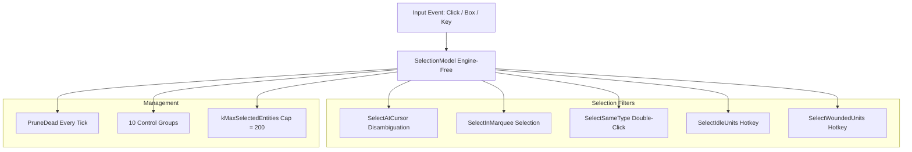

# Red Alert 4 — Player Army Control & Input System Architecture

## Overview

The player army control system in Red Alert 4 provides responsive, intuitive, and modern RTS micro/macro controls while maintaining total engine-free decoupling. Implemented in the `RA4Input` module (`Source/RA4Input`), all selection filtering, stance evaluation, formation placement, order context resolution, and assisted unit commands execute purely in client C++ logic and emit standard `Command` structures validated by the server.

---

## 1. Unit Stances & Autonomous Behaviors

Combat units in Red Alert 4 support 6 behavioral stances (`GroupStance` enum) that govern autonomous target engagement, pursuit distance, and response to incoming fire:

| Stance | Autonomous Engagement | Pursuit Behavior | Retaliation | Typical Use Case |
| :--- | :--- | :--- | :--- | :--- |
| **`Balanced`** | Auto-attacks enemies within weapon range | Pursues short distance (up to 150 tiles), returns to post | Yes | Default army stance |
| **`Aggressive`** | Auto-attacks enemies within vision range | Pursues aggressively until target dies or lost | Yes | Offensive pushes & scouting |
| **`Defensive`** | Attacks enemies entering defensive perimeter | Holds immediate area, never pursues beyond leash range | Yes | Base defense & choker holding |
| **`HoldFire`** | Never auto-attacks, even when fired upon | Holds position, zero pursuit | No | Stealth infiltration & scouting |
| **`HoldPosition`** | Auto-attacks within weapon range | Zero movement/pursuit (hard anchor) | Yes | Artillery & siege lines |
| **`ReturnFire`** | Attacks only entities that attack this unit | Zero pursuit unless directly provoked | Only vs Attacker | Convoy escorts & harvesters |

---

## 2. Selection Model & Modern Selection Filters

Unit selection logic is encapsulated in `SelectionModel` (`RA4Input/Public/RA4Input/SelectionModel.h`). Selection is purely client-side; the server never receives selection arrays, only the commands issued to them.



### 2.1 Disambiguation & Selection Priority
When a player single-clicks ground containing overlapping entities, `GetSelectionPriority()` ranks candidates to ensure the most logical unit is selected:
1. **Owned Armed Units** (Tanks, Combat Infantry) — Highest Priority (Rank 10–20).
2. **Owned Unarmed / Harvesters** — Medium Priority (Rank 30).
3. **Owned Base Buildings** — Low Priority (Rank 50).
4. **Enemy Units & Buildings** — Lowest Priority (Rank 100).

### 2.2 Modern Selection Filters
* **Double-Click Same Type (`SelectSameType`):** Selects all visible owned units matching the prototype's `ContentId` within the current camera frustum.
* **Select Idle Units (`SelectIdleUnits`):** Filters for owned combat units whose `OrderQueue` is currently empty and state is idle.
* **Select Wounded Units (`SelectWoundedUnits`):** Selects owned units whose current HP percentage is below `HealthPercentThreshold` (e.g. < 50%), allowing rapid retreat micro.
* **Control Groups:** 10 persistent control groups (`AssignControlGroup`, `AddToControlGroup`, `RecallControlGroup`). Dead entities are automatically purged via `RecallControlGroup` and `PruneDead()`.
* **Selection Cap (`kMaxSelectedEntities = 200`):** Enforces a maximum selection limit of 200 entities. This guarantees that any command emitted for the selection stays strictly within the server's per-tick command budget (`kMaxCommandsPerPlayerPerTick = 64` or batched command frame limits).

```cpp
class RA4INPUT_API SelectionModel
{
public:
    void SelectAtCursor(const SimWorld& World, const std::vector<EntityId>& Candidates, SelectionMode Mode);
    void SelectInMarquee(const SimWorld& World, const std::vector<EntityId>& Candidates, SelectionMode Mode);
    void SelectSameType(const SimWorld& World, EntityId Prototype, const std::vector<EntityId>& Visible, SelectionMode Mode);
    
    // Modern Selection Filters
    void SelectIdleUnits(const SimWorld& World, SelectionMode Mode);
    void SelectWoundedUnits(const SimWorld& World, int32_t HealthPercentThreshold, SelectionMode Mode);

    // Control Groups & Maintenance
    bool AssignControlGroup(int32_t GroupIndex);
    bool RecallControlGroup(int32_t GroupIndex, const SimWorld& World);
    void PruneDead(const SimWorld& World);
};
```

---

## 3. Formation Movement & Single Flow-Field Optimization

Red Alert 4 features leader-relative formation movement integrated with the `RA4Navigation` module (`RA4Navigation/Formation.h`).

### 3.1 Formation Formations & Slot Offsets
Formations arrange member units in structured spatial patterns around a designated leader entity:
* **`Line`**: Broad frontline array (ideal for tanks and infantry battle lines).
* **`Column`**: Narrow marching column (ideal for road travel and chokepoints).
* **`Wedge`**: Spearhead V-shape (ideal for armored breakthroughs).
* **`Spread`**: Sparse scattered grid (minimizes splash damage from artillery/superweapons).
* **`Screen`**: Heavy armor in front, light missile/artillery units in rear.
* **`Circular`**: 360-degree defensive ring around VIPs or Construction Yards.
* **`Transport`**: Tight packing around transport vehicles.

### 3.2 Leader-Relative Slot Math
Slot offsets are precomputed in normalized formation coordinates. The target position for slot $i$ is calculated as:
$$\text{Pos}_i = \text{LeaderPos} + R(\theta_{\text{leader}}) \cdot \text{Offset}_i$$
where $R(\theta_{\text{leader}})$ is the 2D rotation matrix for the leader's facing vector.

### 3.3 Single Flow-Field Performance Optimization
Instead of evaluating $N$ separate pathfinder queries for an $N$-unit army (which would cause severe pathfinding overhead), the navigation system computes **a single flow field** for the group leader. Member units sample the leader's flow field and apply local formation slot offsets $\text{Offset}_i$, reducing pathfinding computation from $\mathcal{O}(N)$ to $\mathcal{O}(1)$ per group.

---

## 4. Context-Sensitive Orders & Reverse Move

Order resolution (`OrderResolver.h`) translates player gestures (right-clicks, modifier keys, drag-clicks) into validated server commands.

### 4.1 Order Context & Modifier Keys (`OrderContext`)
- **Shift (`bQueueOrder`):** Appends command to unit's `OrderQueue` instead of overriding existing orders.
- **Ctrl (`bForceAttack`):** Forces attack on target location or ally (enables friendly fire / force attack).
- **Alt (`bForceMove`):** Issues move command directly to target tile, ignoring enemy blocking.
- **Attack-Move Mode (`bAttackMoveMode`):** Forces units to move toward destination while engaging any enemy encountered in range.
- **Placement Mode (`bPlacementMode`):** Left-clicking places queued structure at cursor tile (`SetRallyPoint` or `PlaceBuilding`).

```cpp
enum class CursorHint : uint8_t
{
    None = 0,
    Select,
    Move,
    NoEntry,        // Terrain impassable or out of bounds
    Attack,
    ForceAttack,
    Harvest,        // Ore node targeted with harvester selected
    Deliver,        // Refinery targeted with full harvester selected
    Repair,         // Damaged structure targeted with engineer selected
    Capture,        // Enemy building targeted with engineer selected
    SetRallyPoint,
};
```

### 4.2 Reverse Move Mechanics
Armored units (such as Heavy Tanks and Apocalypse Tanks) feature directional armor matrices where frontal armor receives significantly lower damage multipliers than rear armor.
* **Reverse Move Command:** When a reverse-move order is issued (or triggered during tactical retreat micro), the vehicle travels backward at standard reverse speed without rotating its chassis.
* **Armor Integrity:** Keeps frontal armor angled toward pursuing enemy units while retreating, drastically increasing unit survivability during tactical fallbacks.

---

## 5. Assisted Commands & Macro Quality-of-Life

To reduce tedious micro-management, the input layer and unit controller provide several automated assisted commands:
1. **Automated Harvester Docking (`Harvest` / `Deliver`):** Harvesters automatically resolve optimal ore node selection and auto-return to the nearest un-queued Refinery upon reaching capacity.
2. **Auto-Engineer Repair & Capture (`Repair` / `Capture`):** Right-clicking friendly damaged structures automatically dispatches selected Engineers to repair; right-clicking enemy buildings dispatches Engineers to perform instant capture.
3. **Smart Rally Point Placement (`SetRallyPoint`):** Production buildings automatically route newly trained units to the primary rally point tile, automatically forming up into active army groups.
4. **Auto Target Prioritization:** Combat units under fire automatically prioritize high-threat targets (e.g. anti-armor tanks focus on enemy tanks rather than infantry, anti-air units focus on airborne strike craft).
